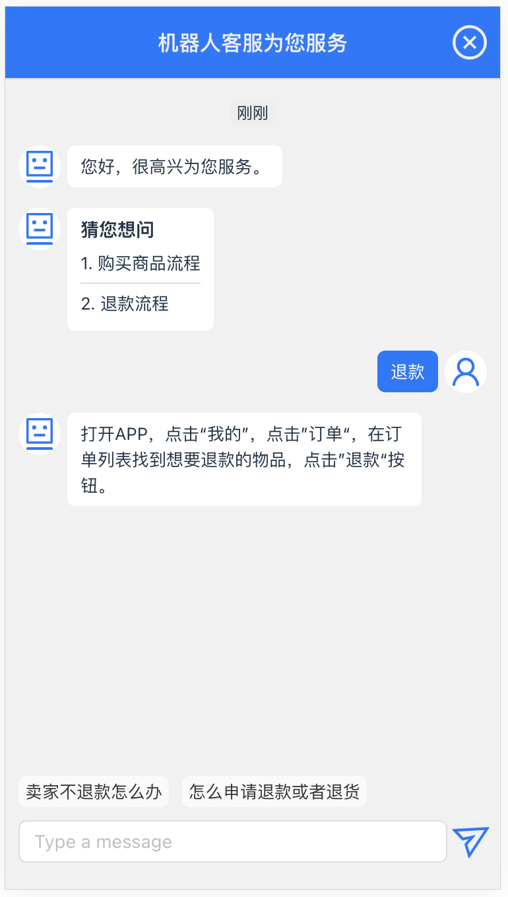
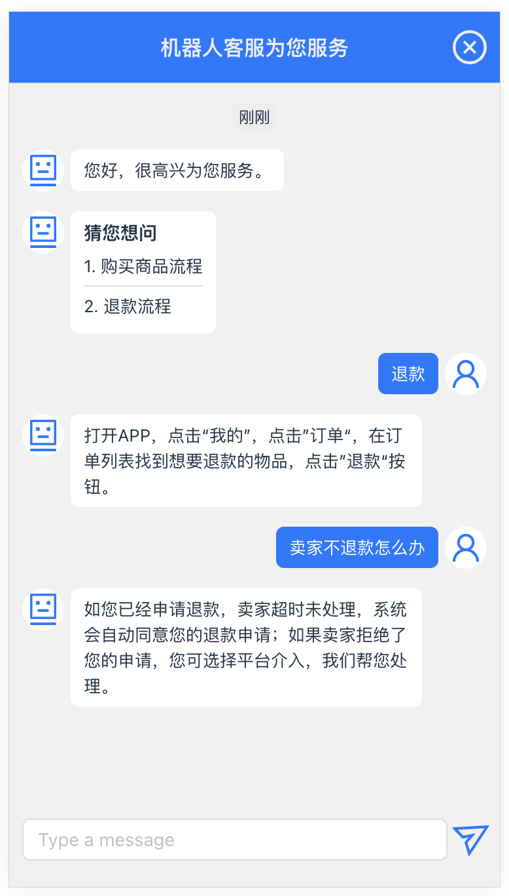

# React Chatbot

使用react框架实现自动回复客服聊哦天框，配置聊天问答模板列表，通过模糊匹配问答列表中的问题，找到适配度最高的内容进行回复。

| | 
|:--:| 
| *手机端截图* |
| | 
| *点击底部提示效果图* |

## 框架
React18 + TypeScript

## node
node use v20+

## 安装
```
npm install isquirrel-react-chatbot
```

## 使用方式
```javascript
import { Chatbot, Dialogue, Message } from "isquirrel-react-chatbot";

const App = () => {
  // 聊天问答列表
  const dialogues: Dialogue[] = [
    {
      question: '你好',
      reply: '您好，请问有什么可以帮助您的吗？',
      isDefault: false
    }
  ]
  return (
    <div>
      <Chatbot
        title="机器人客服为您服务"
        greet="您好，很高兴为您服务。"
        dialogues={dialogues}
        failTips=""
        historyMessages={[]}
        onReply={(message: Message) => {
          console.log("回复消息：", message)
        }}
        getMessages={(messages: Message[]) => {
          console.log("消息列表：", messages)
        }}
      />
    </div>
  )
}


export default App;
```

### props
| 参数 | 类型 | 必填 | 默认值 | 说明 |
|:---|:---|:---|:---|:---|
| onReply | `Function` | false |  | 接收到用户发送的消息后，根据内容匹配到回复时调用，参数为`Message`回复的消息 |
| getMessages | `Function` | false |  | 获取当前所有的消息记录，参数为`Message[]` |
| title | `String` | false | 机器人客服为您服务 | 聊天弹窗标题 |
| greet | `String` | false |  | 进入聊天窗口时默认打招呼的话语 |
| dialogues | [`Dialogue[]`](#dialogue) | true |  | 聊天问答列表 |
| failTips | `String` | false | 亲爱的用户，我不太懂您的意思。 | 匹配失败默认回复的内容 |
| historyMessages | [`Message[]`](#message) | false |  | 聊天的历史记录，用于显示 |
| robotAvatar | `String` | false | 机器人图标 | 机器人头像，图片url |
| userAvatar | `String` | false | 用户图标 | 用户头像，图片url |
| theme | `String` | false | `default` | 主题颜色，允许的值：`default`灰色、`blue`蓝色、`green`绿色 |

### <span id="dialogue">Dialogue</span>
| 参数 | 类型 | 必填 | 说明 |
|:---|:---|:---|:---|
| question | `String` | true | 问题 |
| reply | `String` | true | 回复内容 |
| isDefault | `Boolean` | false | 是否显示在默认的”猜您想问“和底部提示按钮里 |

### <span id="message">Message</span>
| 参数 | 类型 | 必填 | 默认值 | 说明 |
|:---|:---|:---|:---|:---|
| createdAt | `Number` | true | | 创建时间 |
| role | `String` | true | | 消息发送者角色，允许的值：`user `用户、`assistant`客服机器人 |
| type | `String` | false | `content`| 消息内容类型，允许的值：`content`文本内容、`list`”猜您想问“问题列表 |
| content | `String` | false | | 消息内容，文本格式 |
| list | `String[]` | false | | 消息内容，”猜您想问“列表格式 |